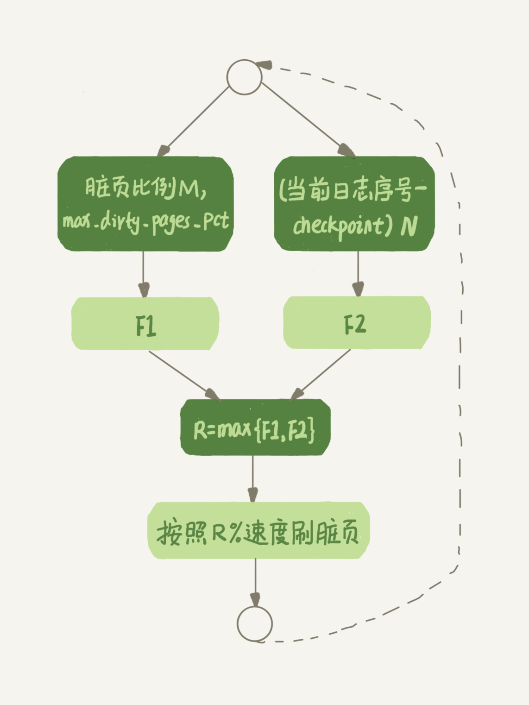
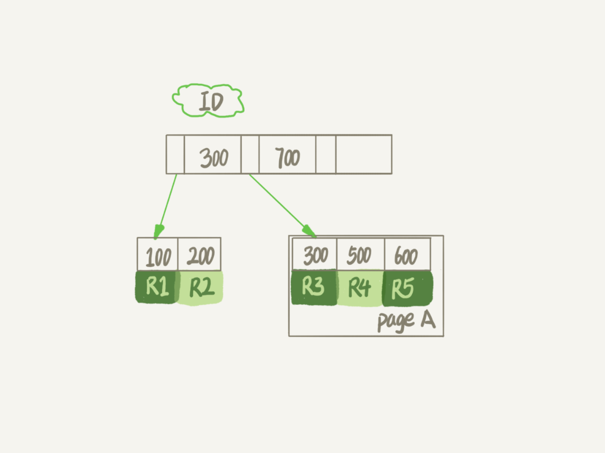
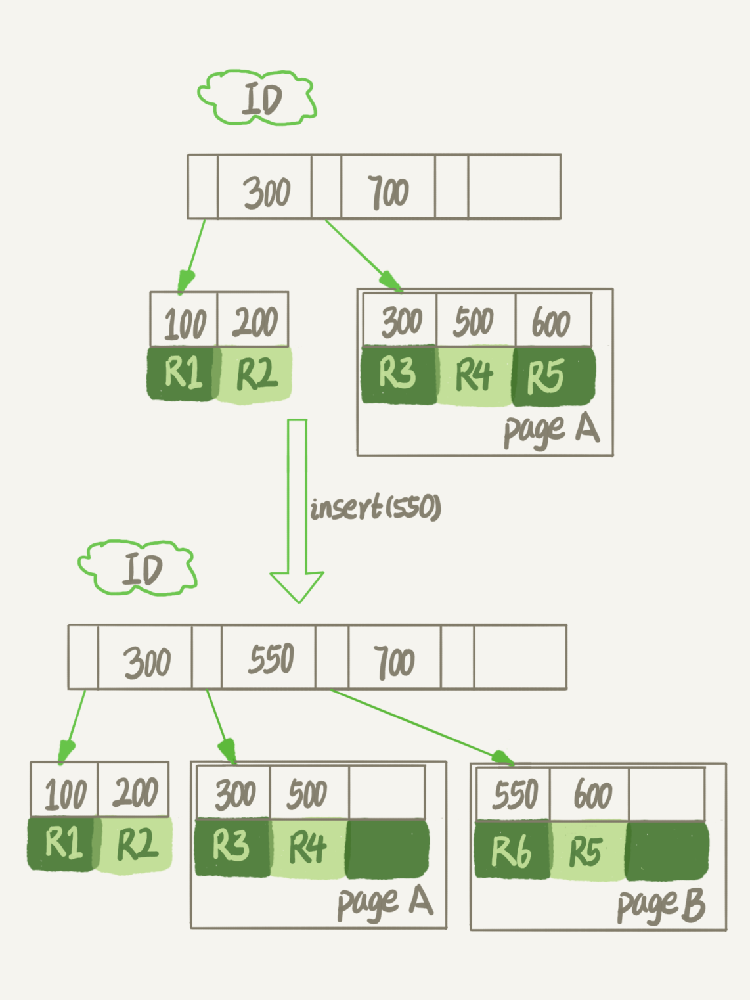
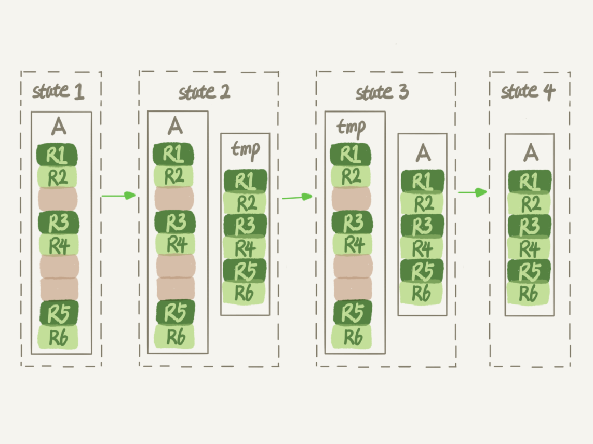
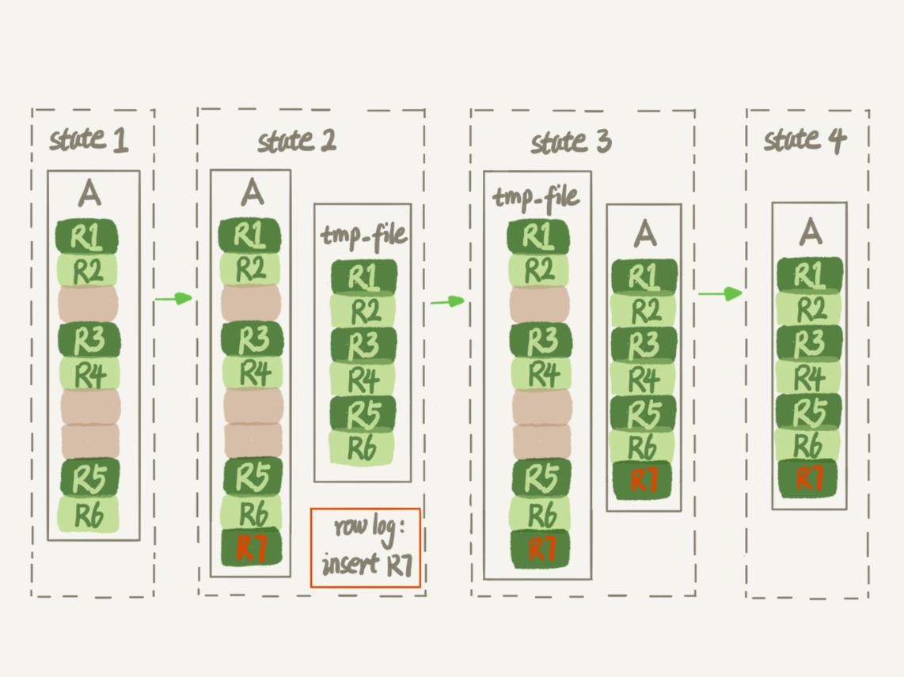

# MySQL 抖动

> 当内存数据页跟磁盘数据页内容不一致的时候，我们称这个内存页为“脏页”。内存数据写入到磁盘后，内存和磁盘上的数据页的内容就一致了，称为“干净页”


刷脏页场景

1. 粉板满了，记录不下了
2. 系统内存不足
3. 系统空闲
4. mysql关闭

## 1、InnoDB刷脏页控制策略

```sql
innodb_io_capacity 
# 这个参数了，它会告诉 InnoDB 你的磁盘能力，建议设置成磁盘的iops

# 测试磁盘的iops命令
fio -filename=$filename -direct=1 -iodepth 1 -thread -rw=randrw -ioengine=psync -bs=16k -size=500M -numjobs=10 -runtime=10 -group_reporting -name=mytest 
```

刷盘速度参考因素：脏页比例、redo log写盘速度

```sql
innodb_max_dirty_pages_pct
# 是脏页比例上限，默认值是 75%

# InnoDB 每次写入的日志都有一个序号，当前写入的序号跟 checkpoint 对应的序号之间的差值，我们假设为 N

```

**根据算得的 F1(M) 和 F2(N) 两个值，取其中较大的值记为 R，之后引擎就可以按照 innodb_io_capacity 定义的能力乘以 R% 来控制刷脏页的速度**



```sql
# 脏页比例计算
select VARIABLE_VALUE into @a from global_status where VARIABLE_NAME = 'Innodb_buffer_pool_pages_dirty';
select VARIABLE_VALUE into @b from global_status where VARIABLE_NAME = 'Innodb_buffer_pool_pages_total';
select @a/@b;
```

```sql
# 脏页刷新“连坐” 
innodb_flush_neighbors
# 值为 1 的时候会有上述的“连坐”机制，值为 0 时表示不找邻居，自己刷自己的
```

# 表删除，文件大小未变

## 1、表数据存放

表数据既可以存在共享表空间里，也可以是单独的文件。这个行为是由参数 **innodb_file_per_table** 控制的

1. 这个参数设置为 OFF 表示的是，表的数据放在系统共享表空间，也就是跟数据字典放在一起；
2. 这个参数设置为 ON 表示的是，每个 InnoDB 表数据存储在一个以 .ibd 为后缀的文件中。

## 2、数据删除流程



> 要删掉 R4 这个记录，InnoDB 引擎只会把 R4 这个记录标记为删除。如果之后要再插入一个 ID 在 300 和 600 之间的记录时，可能会复用这个位置。但是，磁盘文件的大小并不会缩小
>
> 删掉了一个数据页上的所有记录，整个数据页就可以被复用了

delete 命令其实只是把记录的位置，或者数据页标记为了“可复用”，但磁盘文件的大小是不会变的。也就是说，通过 delete 命令是不能回收表空间的。这些可以复用，而没有被使用的空间，看起来就像是“空洞”

**不止是删除数据会造成空洞，插入数据也会**



由于 page A 满了，再插入一个 ID 是 550 的数据时，就不得不再申请一个新的页面 page B 来保存数据了。页分裂完成后，page A 的末尾就留下了空洞

## 3、重建表

```sql
alter table A engine=InnoDB
```



> 花时间最多的步骤是往临时表插入数据的过程，如果在这个过程中，有新的数据要写入到表 A 的话，就会造成数据丢失。因此，在整个 DDL 过程中，表 A 中不能有更新。也就是说，这个 DDL 不是 Online 的

**MySQL 5.6 版本开始引入的 Online DDL，对这个操作流程做了优化**



> alter 语句在启动的时候需要获取 MDL 写锁，但是这个写锁在真正拷贝数据之前就退化成读锁了。为什么要退化呢？为了实现 Online，MDL 读锁不会阻塞增删改操作。那为什么不干脆直接解锁呢？为了保护自己，禁止其他线程对这个表同时做 DDL

## 4、Online和inplace

5.6之前：把表 A 中的数据导出来的存放位置叫作 tmp_table。这是一个临时表，是在 server 层创建的

5.6之后：据表 A 重建出来的数据是放在“tmp_file”里的，这个临时文件是 InnoDB 在内部创建出来的。整个 DDL 过程都在 InnoDB 内部完成。对于 server 层来说，没有把数据挪动到临时表，是一个“原地”操作，这就是“inplace”名称的来源

```sql
alter table t engine=InnoDB;
# 其实隐含的意思是：
alter table t engine=innodb,ALGORITHM=inplace;
# 与之对应的是
alter table t engine=innodb,ALGORITHM=copy;

```

## 5、区别

optimize table、analyze table 和 alter table 这三种方式重建表的区别

- 从 MySQL 5.6 版本开始，alter table t engine = InnoDB（也就是 recreate）默认的就是上面图的流程了；
- analyze table t 其实不是重建表，只是对表的索引信息做重新统计，没有修改数据，这个过程中加了 MDL 读锁；
- optimize table t 等于 recreate+analyze。

# count(*)慢

## 1、实现方式

- MyISAM 引擎把一个表的总行数存在了磁盘上，因此执行 count(\*) 的时候会直接返回这个数，效率很高
- 而 InnoDB 引擎就麻烦了，它执行 count(*) 的时候，需要把数据一行一行地从引擎里面读出来，然后累积计数。

由于MVCC的方式，innoDB无法把总行数记录下来

> 在保证逻辑正确的前提下，尽量减少扫描的数据量，是数据库系统设计的通用法则之一

```sql
show table status
# 采样估计值，误差较大
```

## 2、不同count用法

> 1. server 层要什么就给什么；
> 2. InnoDB 只给必要的值；
> 3. 现在的优化器只优化了 count(*) 的语义为“取行数”，其他“显而易见”的优化并没有做。

- 对于 count(主键 id) 来说，InnoDB 引擎会遍历整张表，把每一行的 id 值都取出来，返回给 server 层。server 层拿到 id 后，判断是不可能为空的，就按行累加。
- 对于 count(1) 来说，InnoDB 引擎遍历整张表，但不取值。server 层对于返回的每一行，放一个数字“1”进去，判断是不可能为空的，按行累加。

- 对于 count(字段) 来说：
  - 如果这个“字段”是定义为 not null 的话，一行行地从记录里面读出这个字段，判断不能为 null，按行累加；
  - 如果这个“字段”定义允许为 null，那么执行的时候，判断到有可能是 null，还要把值取出来再判断一下，不是 null 才累加。
- 但是 count(\*) 是例外，并不会把全部字段取出来，而是专门做了优化，不取值。count(*) 肯定不是 null，按行累加

