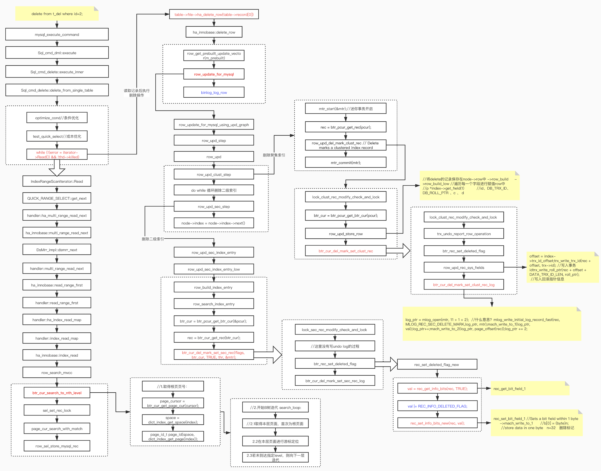

# delete 流程

1、涉及函数

```shell
[0] row_sel_store_mysql_rec(unsigned char*, row_prebuilt_t*, unsigned char const*, dtuple_t const*, bool, dict_index_t const*, dict_index_t const*, unsigned long const*, bool, lob::undo_vers_t*, mem_block_info_t*&)+297 at ./storage/innobase/row/row0sel.cc:2898
[1] row_search_mvcc(unsigned char*, page_cur_mode_t, row_prebuilt_t*, unsigned long, unsigned long)+15117 at ./storage/innobase/row/row0sel.cc:5576
[2] ha_innobase::index_read(unsigned char*, unsigned char const*, unsigned int, ha_rkey_function)+1866 at ./storage/innobase/handler/ha_innodb.cc:10262
[3] ha_innobase::index_first(unsigned char*)+111 at ./storage/innobase/handler/ha_innodb.cc:10612
[4] ha_innobase::rnd_next(unsigned char*)+141 at ./storage/innobase/handler/ha_innodb.cc:10801
[5] handler::ha_rnd_next(unsigned char*)+595 at ./sql/handler.cc:2971
[6] TableScanIterator::Read()+157 at ./sql/iterators/basic_row_iterators.cc:219
[7] Query_expression::ExecuteIteratorQuery(THD*)+1404 at ./sql/sql_union.cc:1770
[8] Query_expression::execute(THD*)+252 at ./sql/sql_union.cc:1823
[9] Sql_cmd_dml::execute_inner(THD*)+206 at ./sql/sql_select.cc:1022
[10] Sql_cmd_dml::execute(THD*)+1773 at ./sql/sql_select.cc:793
[11] mysql_execute_command(THD*, bool)+21692 at ./sql/sql_parse.cc:4719
[12] dispatch_sql_command(THD*, Parser_state*)+1950 at ./sql/sql_parse.cc:5368
[13] dispatch_command(THD*, COM_DATA const*, enum_server_command)+5869 at ./sql/sql_parse.cc:2054
[14] do_command(THD*)+1469 at ./sql/sql_parse.cc:1439
```


```bash
# 1、
dispatch_command
	dispatch_sql_command
		parse_sql
		mysql_execute_command
			Sql_cmd_dml::execute
				Sql_cmd_delete::delete_from_single_table
					IndexRangeScanIterator::Read
```


```
...
row_search_mvcc
btr_cur_search_to_nth_level
sel_set_rec_lock
page_cur_search_with_match
row_sel_store_mysql_rec
```




