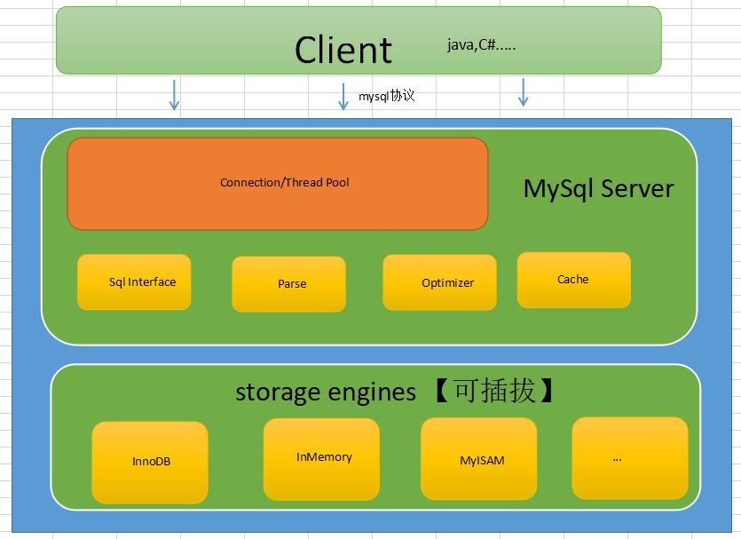
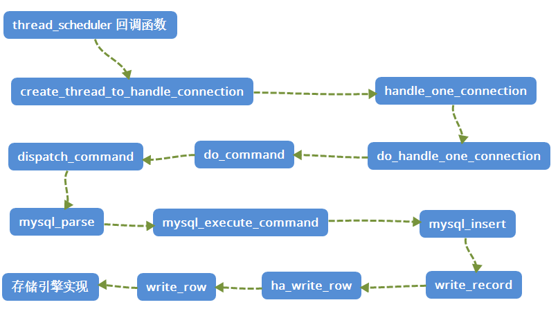

# MySQL数据插入流程

# 1、概况



# 2、调用链路图



# 3、关键函数

## 1、mysql_execute_command

位置：`sql/sql_parse.cc/mysql_execute_command`
函数签名：`int mysql_execute_command(THD *thd, bool first_level)`
函数解释：Execute command saved in thd and lex->sql_command
签名解释：
  **thd**：一个指向当前线程处理数据的 THD 结构的指针。
  **first_level**：一个布尔值，表示是否在执行的是最外层的命令。


 关键点

```c++
switch (lex->sql_command)
{
  case SQLCOM_SLEEP:
    /* ... */
    break;
  case SQLCOM_CREATE_TABLE:
    /* ... */
    break;
  case SQLCOM_DROP_TABLE:
    /* ... */
    break;
  case SQLCOM_ALTER_TABLE:
    /* ... */
    break;
  case SQLCOM_RENAME_TABLE:
    /* ... */
    break;
  /* ... */
  case SQLCOM_REPLACE:
  case SQLCOM_INSERT:
  case SQLCOM_REPLACE_SELECT:
  case SQLCOM_INSERT_SELECT:
  {
    assert(first_table == all_tables && first_table != 0);
    assert(lex->m_sql_cmd != NULL);
    res = lex->m_sql_cmd->execute(thd);
    break;
  }
  /* ... */
  default:
    /* ... */
    break;
}
/*
解释：使用了 switch 语句来根据 lex->sql_command（当前解析到的 SQL 命令）的类型，分派到不同的 case 块关键点：
*/
```

## 2、execute

```

```

位置：`sql/sql_insert.cc/Sql_cmd_insert::execute  `
函数签名：`bool Sql_cmd_insert::execute(THD *thd) `
函数解释： 
签名解释：


关键点

```c++
TABLE_LIST *table_list= tables;
bool res= false;

table_list->prepare_for_use(TABLE_LIST::INSERT, thd);
if (!thd_proc_info(thd, table_list->table->full_name.str))
  goto err;

if (table_list->table->insert_values_part)
{
  if (!table_list->prepare_insert(thd))
    goto err;
  res= insert_select::prepare_and_execute_insert_select(thd, table_list);
}
else
{
  DBUG_ASSERT(!table_list->table->s->insert_select);
  if (table_list->table->write_set)
    table_list->table->null_row= !table_list->table->write_set->can_insert();
  res= insert_values(thd, table_list);
}

if (res && thd->is_error())
  goto err;

res= FALSE;
err:
table_list->cleanup_after_query();
return res;

/*
首先，将传入的 tables 赋值给局部变量 table_list，用于后续处理。
table_list->prepare_for_use(TABLE_LIST::INSERT, thd); 调用 prepare_for_use() 方法来准备表格列表，将操作类型设置为 INSERT。
thd_proc_info(thd, table_list->table->full_name.str) 更新线程处理信息，显示正在处理的表格名。
这段代码通过判断表格是否有 insert_values_part 来区分插入方式是基于具体值插入还是通过子查询插入。如果是基于子查询插入，会调用 insert_select::prepare_and_execute_insert_select() 来处理，否则会调用 insert_values()。
table_list->table->write_set 是一个表示插入操作要写入的列的位图。如果有插入权限的列，将 null_row 设置为 false，表示可以插入。
如果执行成功但出现错误，则会设置 res = FALSE。
最后，会调用 table_list->cleanup_after_query() 来清理查询后的状态，然后返回结果。
*/
```


## 3、mysql_insert

位置：`sql/sql_insert.cc/Sql_cmd_insert::mysql_inser`
函数签名：`bool Sql_cmd_insert::mysql_insert(THD *thd,TABLE_LIST *table_list)` 
函数解释：INSERT statement implementation 
签名解释：
​	**thd**：一个指向当前线程处理数据的 THD 结构的指针。
​	**table_list**：一个指向要插入数据的目标表的 TABLE_LIST 结构的指针


关键点???

```c++
TABLE *table = table_list->table;
Item **values;
List<Item> values_list;

table->in_use = TRUE;

if (init_table_read_record(table_list, 1))
  goto err;

values = fill_record(table, table->record[0], table->write_set, values_list);

if (values == (Item **) 1)
  goto err;

if (mysql_update(thd, table_list, values))
  goto err;

DBUG_ASSERT(!thd->is_error());
table->in_use = FALSE;
return 0;

/*
首先，将从 table_list 获取目标表格的指针，并创建一个 values_list 用于存储插入语句中的值。
将目标表格的 in_use 设置为 TRUE，表示当前表格正在被使用。
init_table_read_record(table_list, 1) 用于初始化读取记录的操作。如果初始化失败，会跳转到 err 标签进行错误处理。
fill_record() 函数用于填充插入的记录值，返回一个指向记录值的数组 values。如果返回的是 (Item **) 1，表示出现错误，会跳转到 err 标签进行错误处理。
mysql_update() 函数用于执行实际的插入操作。如果插入过程中出现错误，会跳转到 err 标签进行错误处理。
DBUG_ASSERT(!thd->is_error()) 断言确保在插入过程中没有出现错误。
最后，将目标表格的 in_use 设置为 FALSE，表示当前表格不再被使用，然后返回 0，表示插入操作成功完成。
*/
```


## 4、write_record

位置：`sql/sql_insert.cc/write_record`
函数签名：`int write_record(THD *thd, TABLE *table, COPY_INFO *info, COPY_INFO *update)`
函数解释：Write a record to table with optional deletion of conflicting records, invoke proper triggers if needed. 
签名解释： 
    **thd**：一个指向当前线程处理数据的 THD 结构的指针。 
    **table**：一个指向目标表格的 TABLE 结构的指针。 
    **info**：一个指向 COPY_INFO 结构的指针，包含了要写入的记录信息。 
    **update**：一个指向 COPY_INFO 结构的指针，用于更新操作


关键点

```c++
while ((error=table->file->ha_write_row(table->record[0])))
```


## 5、ha_write_row

位置：`sql/handler.cc/ha_write_row `
函数签名：`int handler::ha_write_row(uchar *buf)` 
函数解释： 
签名解释：
	**uchar *buf**：一个指向存储待写入数据的缓冲区的指针


关键点：

```c++
MYSQL_TABLE_IO_WAIT(PSI_TABLE_WRITE_ROW, MAX_KEY, error,
    { error= write_row(buf); })

// write_row是个虚方法，也就是给底层方法实现的，在这里就是给各大Storage Engines的
```


# 4、备注

引用文档1：[博客园-mysql轻松入门](https://www.cnblogs.com/huangxincheng/p/13029069.html)


