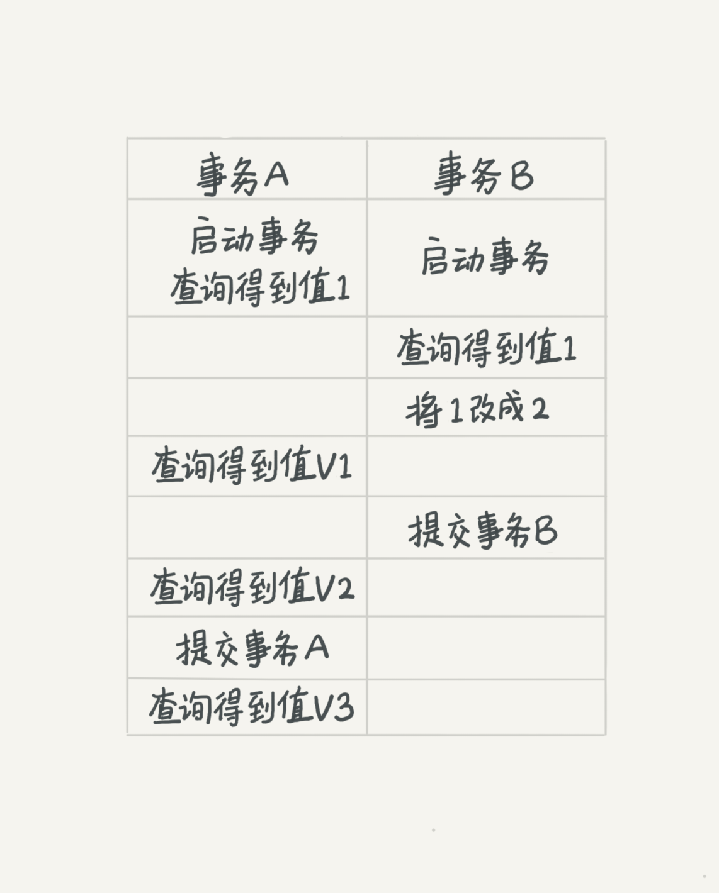
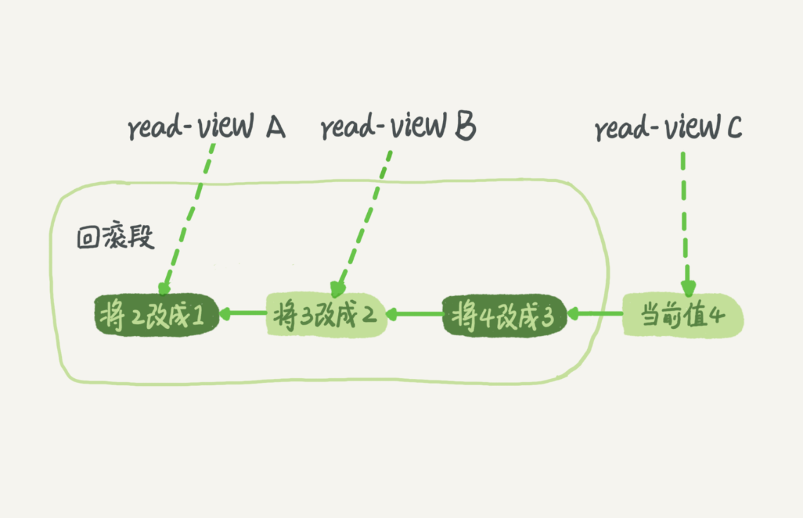
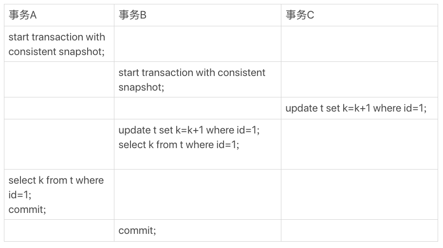

# 事务隔离

> 事务
>
> ACID（Atomicity、Consistency、Isolation、Durability，即原子性、一致性、隔离性、持久性）

## 1、隔离性与隔离级别

当多个事务同时执行的时候，就可能出现**脏读、不可重复度、幻读**。

为了解决以上问题，就有了隔离级别的概念。隔离级别有以下四种

-  读未提交
- 读已提交
- 可重复读
- 串行化

举例：



> 若隔离级别是“读未提交”， 则 V1 的值就是 2。这时候事务 B 虽然还没有提交，但是结果已经被 A 看到了。因此，V2、V3 也都是 2。
>
> 若隔离级别是“读提交”，则 V1 是 1，V2 的值是 2。事务 B 的更新在提交后才能被 A 看到。所以， V3 的值也是 2。
>
> 若隔离级别是“可重复读”，则 V1、V2 是 1，V3 是 2。之所以 V2 还是 1，遵循的就是这个要求：事务在执行期间看到的数据前后必须是一致的。
>
> 若隔离级别是“串行化”，则在事务 B 执行“将 1 改成 2”的时候，会被锁住。直到事务 A 提交后，事务 B 才可以继续执行。所以从 A 的角度看， V1、V2 值是 1，V3 的值是 2。

实现上，数据库创建一个视图，访问时候已视图的逻辑结果为准

可重复读隔离下，视图是在事务启动时创建的，整个事物存在期间都用这个视图

读已提交隔离下，视图是在每个sql语句开始执行的时候创建


事务的隔离级别设置

```sql
# 5.7版本查询
mysql> show variables like '%transaction_isolation%';
+-----------------------+-----------------+
| Variable_name         | Value           |
+-----------------------+-----------------+
| transaction_isolation | REPEATABLE-READ |
+-----------------------+-----------------+

# 5.6版本查询
show variables like '%tx_isolation%';
```


## 2、事务隔离的实现

每条记录在更新的时候都会同时记录一条回滚操作。记录上的最新值，通过回滚操作，都可以得到前一个状态的值。



每个启动的事务会有不同视图，当启动的事务在前时，回滚到需要的视图记录的状态值

回滚日志删除，当没有事务需要用到这些回滚日志时，回滚日志会被删除。当系统里没有比这个回滚日志更早的read-view的时候

## 3、事务的启动方式

1、显示启动事务，begin或者start transaction。配套的提交语句时commit，回滚语句时rollback

```sql
begin/start transaction 命令并不是一个事务的起点，在执行到它们之后的第一个操作 InnoDB 表的语句，事务才真正启动
马上启动一个事务，可以使用 start transaction with consistent snapshot
```

2、set auto commit=0,将这个线程的自动提交关掉。

```sql
# 查看长事务
select * from information_schema.innodb_trx where TIME_TO_SEC(timediff(now(),trx_started))>60
```

## 4、锁事务

一个事务要更新一行，如果刚好有另外一个事务拥有这一行的行锁，它又不能这么超然了，会被锁住，进入等待状态。问题是，既然进入了等待状态，那么等到这个事务自己获取到行锁要更新数据的时候，它读到的值又是什么呢？

```sql
CREATE TABLE `t` (
  `id` int(11) NOT NULL,
  `k` int(11) DEFAULT NULL,
  PRIMARY KEY (`id`)
) ENGINE=InnoDB;

insert into t(id, k) values(1,1),(2,2);
```




> 事务 B 查到的 k 的值是 3，而事务 A 查到的 k 的值是 1

## 5、“快照”与MVCC

RR隔离级别下，事务快照是整个**库**级别的

每个事务在开始的时候申请一个id，**transaction id**，按照申请顺序严格递增


