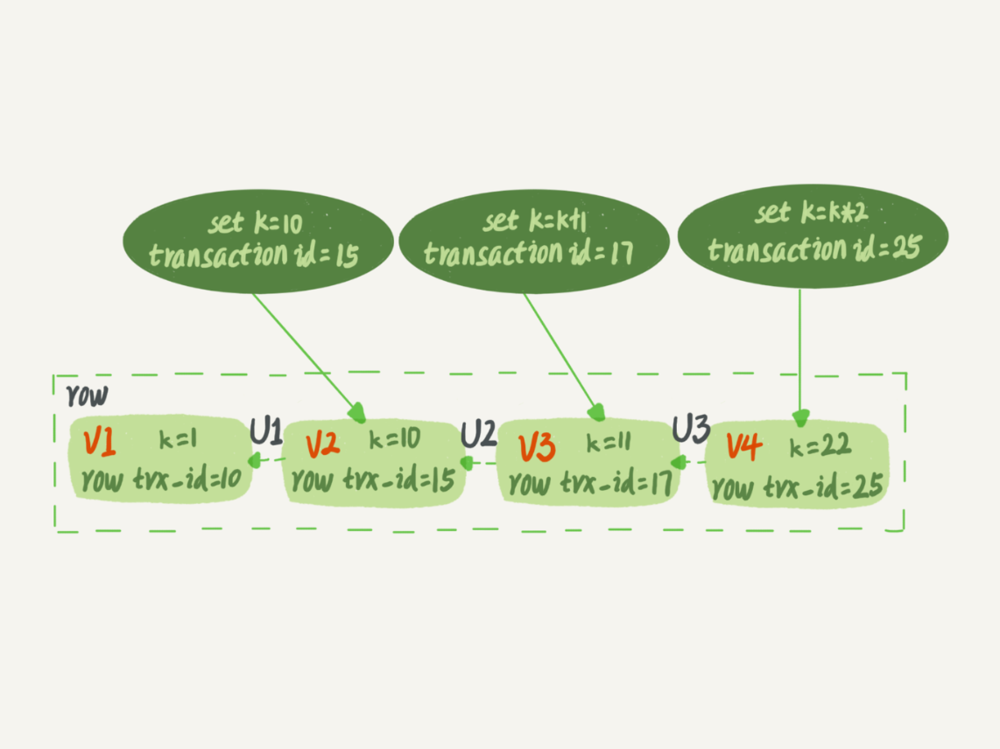
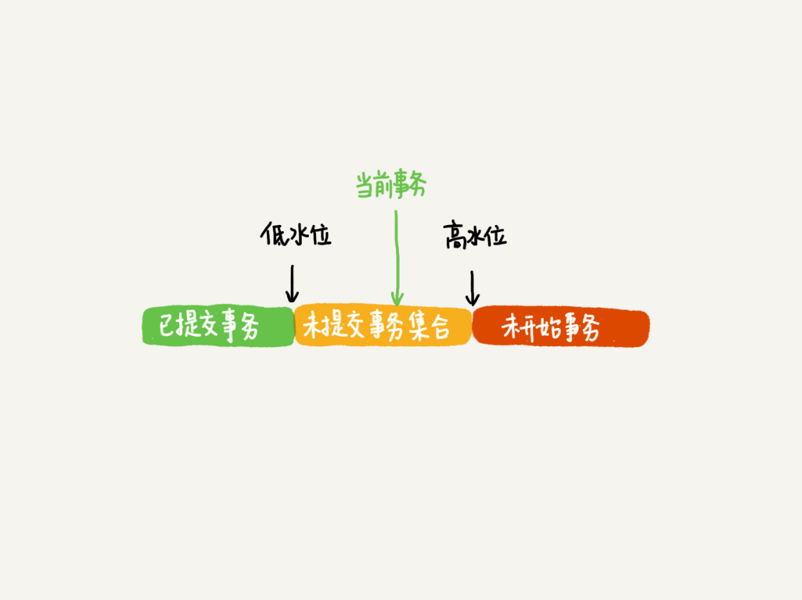
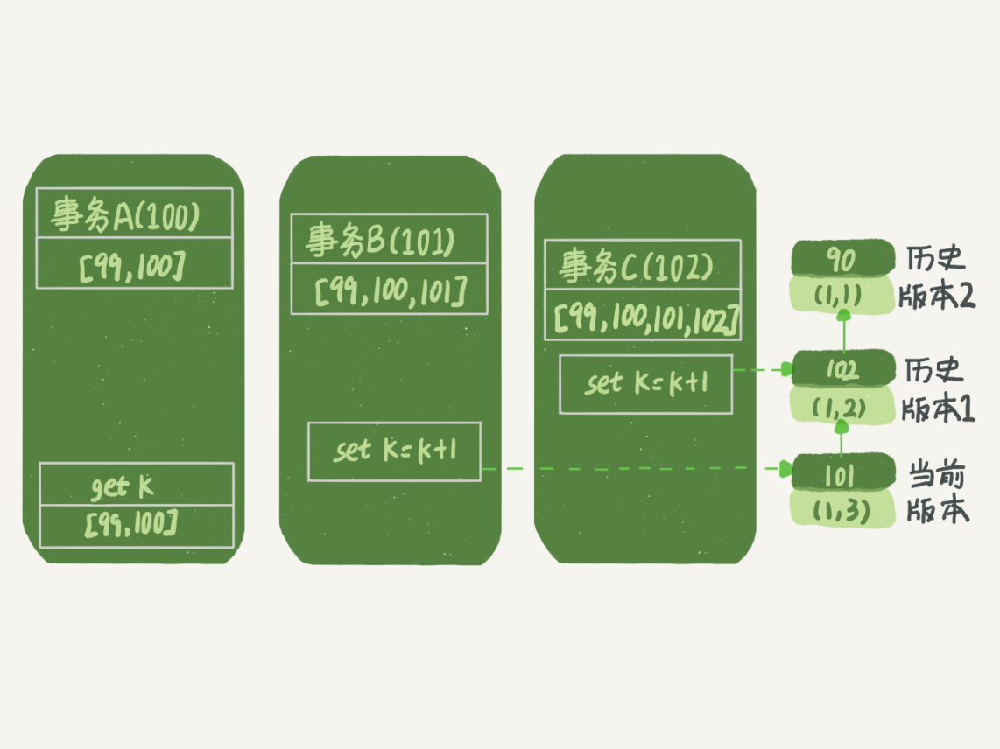
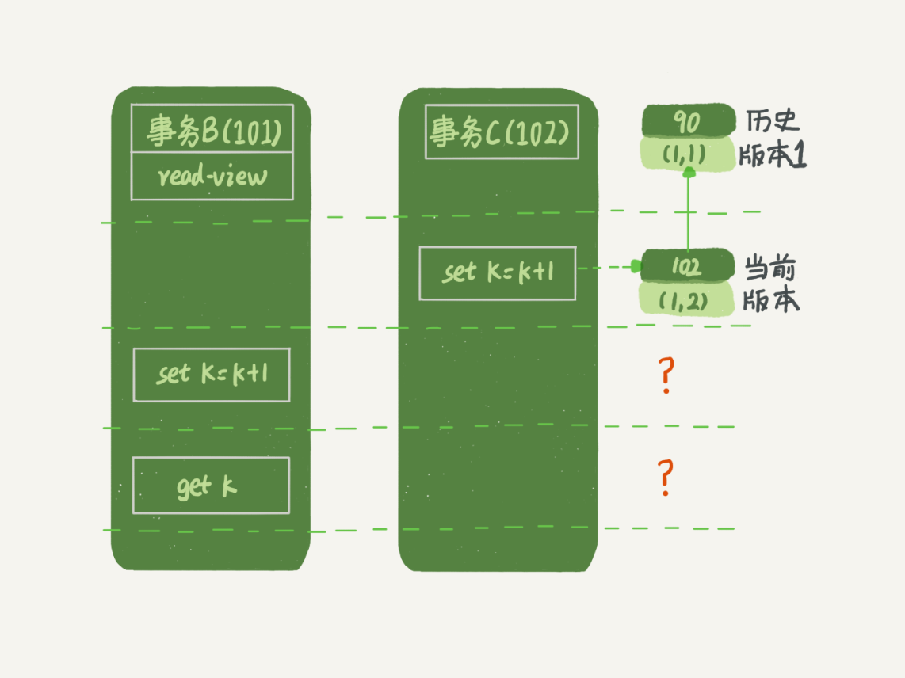
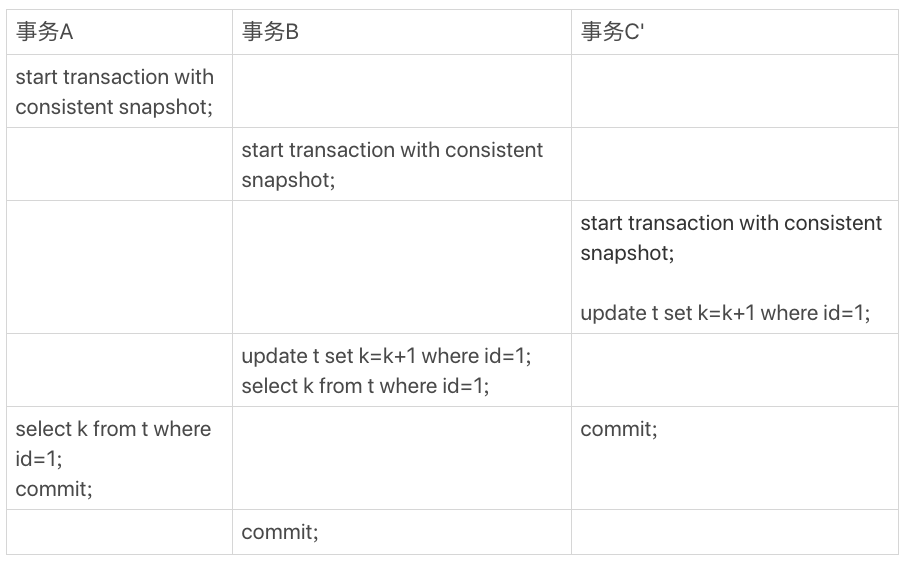
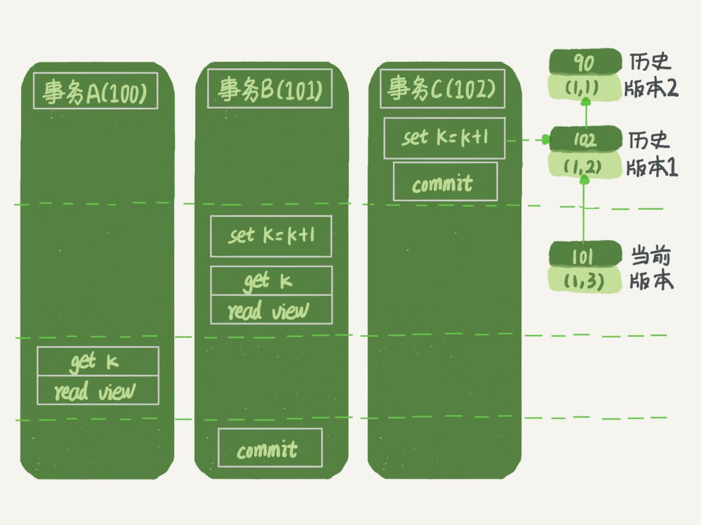

# 事务隔离

> 事务
>
> ACID（Atomicity、Consistency、Isolation、Durability，即原子性、一致性、隔离性、持久性）

## 1、隔离性与隔离级别

当多个事务同时执行的时候，就可能出现**脏读、不可重复度、幻读**。

为了解决以上问题，就有了隔离级别的概念。隔离级别有以下四种

-  读未提交
- 读已提交
- 可重复读
- 串行化

举例：


> 若隔离级别是“读未提交”， 则 V1 的值就是 2。这时候事务 B 虽然还没有提交，但是结果已经被 A 看到了。因此，V2、V3 也都是 2。
>
> 若隔离级别是“读提交”，则 V1 是 1，V2 的值是 2。事务 B 的更新在提交后才能被 A 看到。所以， V3 的值也是 2。
>
> 若隔离级别是“可重复读”，则 V1、V2 是 1，V3 是 2。之所以 V2 还是 1，遵循的就是这个要求：事务在执行期间看到的数据前后必须是一致的。
>
> 若隔离级别是“串行化”，则在事务 B 执行“将 1 改成 2”的时候，会被锁住。直到事务 A 提交后，事务 B 才可以继续执行。所以从 A 的角度看， V1、V2 值是 1，V3 的值是 2。

实现上，数据库创建一个视图，访问时候已视图的逻辑结果为准

可重复读隔离下，视图是在事务启动时创建的，整个事物存在期间都用这个视图

读已提交隔离下，视图是在每个sql语句开始执行的时候创建


事务的隔离级别设置

```sql
# 5.7版本查询
mysql> show variables like '%transaction_isolation%';
+-----------------------+-----------------+
| Variable_name         | Value           |
+-----------------------+-----------------+
| transaction_isolation | REPEATABLE-READ |
+-----------------------+-----------------+

# 5.6版本查询
show variables like '%tx_isolation%';
```


## 2、事务隔离的实现

每条记录在更新的时候都会同时记录一条回滚操作。记录上的最新值，通过回滚操作，都可以得到前一个状态的值。


每个启动的事务会有不同视图，当启动的事务在前时，回滚到需要的视图记录的状态值

回滚日志删除，当没有事务需要用到这些回滚日志时，回滚日志会被删除。当系统里没有比这个回滚日志更早的read-view的时候

## 3、事务的启动方式

1、显示启动事务，begin或者start transaction。配套的提交语句时commit，回滚语句时rollback

```sql
begin/start transaction 命令并不是一个事务的起点，在执行到它们之后的第一个操作 InnoDB 表的语句，事务才真正启动
马上启动一个事务，可以使用 start transaction with consistent snapshot
```

2、set auto commit=0,将这个线程的自动提交关掉。

```sql
# 查看长事务
select * from information_schema.innodb_trx where TIME_TO_SEC(timediff(now(),trx_started))>60
```

## 4、锁事务

一个事务要更新一行，如果刚好有另外一个事务拥有这一行的行锁，它又不能这么超然了，会被锁住，进入等待状态。问题是，既然进入了等待状态，那么等到这个事务自己获取到行锁要更新数据的时候，它读到的值又是什么呢？

```sql
CREATE TABLE `t` (
  `id` int(11) NOT NULL,
  `k` int(11) DEFAULT NULL,
  PRIMARY KEY (`id`)
) ENGINE=InnoDB;

insert into t(id, k) values(1,1),(2,2);
```


> 事务 B 查到的 k 的值是 3，而事务 A 查到的 k 的值是 1

## 5、“快照”与MVCC

RR隔离级别下，事务快照是整个**库**级别的

每个事务在开始的时候申请一个id，**transaction id**，按照申请顺序严格递增

每次事务更新数据的时候，都会生成一个新的数据版本，并且把 transaction id 赋值给这个数据版本的事务 ID，记为 row trx_id。同时，旧的数据版本要保留



图中三个虚线箭头就是**undo log**，v1、v2、v3不是屋里存在的，而是根据当前版本和undo log计算出来的。

> 一个事务只需要在启动的时候声明说，“以我启动的时刻为准，如果一个数据版本是在我启动之前生成的，就认；如果是我启动以后才生成的，我就不认，我必须要找到它的上一个版本”

在实现上， InnoDB 为每个事务构造了一个数组，用来保存这个事务启动瞬间，当前正在“活跃”的所有事务 ID。“活跃”指的就是，启动了但还没提交。

数组里面事务 ID 的最小值记为低水位，当前系统里面已经创建过的事务 ID 的最大值加 1 记为高水位。这个视图数组和高水位，就组成了当前事务的一致性视图（read-view）



1. 如果落在绿色部分，表示这个版本是已提交的事务或者是当前事务自己生成的，这个数据是可见的；

2. 如果落在红色部分，表示这个版本是由将来启动的事务生成的，是肯定不可见的；

3. 如果落在黄色部分，那就包括两种情况

   a. 若 row trx_id 在数组中，表示这个版本是由还没提交的事务生成的，不可见；

   b. 若 row trx_id 不在数组中，表示这个版本是已经提交了的事务生成的，可见。

## 6、锁事务问题解释



虽然期间这一行数据被修改过，但是事务 A 不论在什么时候查询，看到这行数据的结果都是一致的，所以我们称之为一致性读。

- 版本未提交，不可见；
- 版本已提交，但是是在视图创建后提交的，不可见；
- 版本已提交，而且是在视图创建前提交的，可见。

## 7、更新逻辑



> 更新数据都是先读后写的，而这个读，只能读当前的值，称为“当前读”（current read）

```sql
# 添加锁，当前读。
select k from t where id=1 lock in share mode;
select k from t where id=1 for update;
```

假设事务 C 不是马上提交的，而是变成了下面的事务 C’，会怎么样呢



> 事务 C’没提交，也就是说 (1,2) 这个版本上的写锁还没释放。而事务 B 是当前读，必须要读最新版本，而且必须加锁，因此就被锁住了，必须等到事务 C’释放这个锁，才能继续它的当前读

## 8、可重复读实现

> 可重复读的核心就是一致性读（consistent read）；而事务更新数据的时候，只能用当前读。如果当前的记录的行锁被其他事务占用的话，就需要进入锁等待。

读提交的实现

> 读提交的逻辑和可重复读的逻辑类似，它们最主要的区别是：
>
> 在可重复读隔离级别下，只需要在事务开始的时候创建一致性视图，之后事务里的其他查询都共用这个一致性视图；
>
> 在读提交隔离级别下，每一个语句执行前都会重新算出一个新的视图。



## 9、小结

InnoDB 的行数据有多个版本，每个数据版本有自己的 row trx_id，每个事务或者语句有自己的一致性视图。普通查询语句是一致性读，一致性读会根据 row trx_id 和一致性视图确定数据版本的可见性。

- 对于可重复读，查询只承认在事务启动前就已经提交完成的数据；
- 对于读提交，查询只承认在语句启动前就已经提交完成的数据；

而当前读，总是读取已经提交完成的最新版本。


10、总结

1. innodb支持RC和RR隔离级别实现是用的一致性视图(consistent read view) 
2. 事务在启动时会拍一个快照,这个快照是基于整个库的. 基于整个库的意思就是说一个事务内,整个库的修改对于该事务都是不可见的(对于快照读的情况) 如果在事务内select t表,另外的事务执行了DDL t表,根据发生时间,要嘛锁住要嘛报错(参考第六章) 
3. 事务是如何实现的MVCC呢? 
   1. 每个事务都有一个事务ID,叫做transaction id(严格递增) 
   2. 事务在启动时,找到已提交的最大事务ID记为up_limit_id。 
   3. 事务在更新一条语句时,比如id=1改为了id=2.会把id=1和该行之前的row trx_id写到undo log里, 并且在数据页上把id的值改为2,并且把修改这条语句的transaction id记在该行行头 
   4. 再定一个规矩,一个事务要查看一条数据时,必须先用该事务的up_limit_id与该行的transaction id做比对, 如果up_limit_id>=transaction id,那么可以看.如果up_limit_id<transaction id,则只能去undo log里去取。去undo log查找数据的时候,也需要做比对,必须up_limit_id>transaction id,才返回数据 
4. 什么是当前读,由于当前读都是先读后写,只能读当前的值,所以为当前读.会更新事务内的up_limit_id为该事务的transaction id 
5. 为什么rr能实现可重复读而rc不能,分两种情况 
   1. 快照读的情况下,rr不能更新事务内的up_limit_id,    而rc每次会把up_limit_id更新为快照读之前最新已提交事务的transaction id,则rc不能可重复读
   2. 当前读的情况下,rr是利用record lock+gap lock来实现的,而rc没有gap,所以rc不能可重复读


