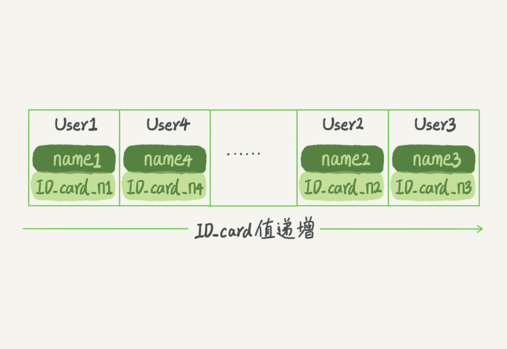
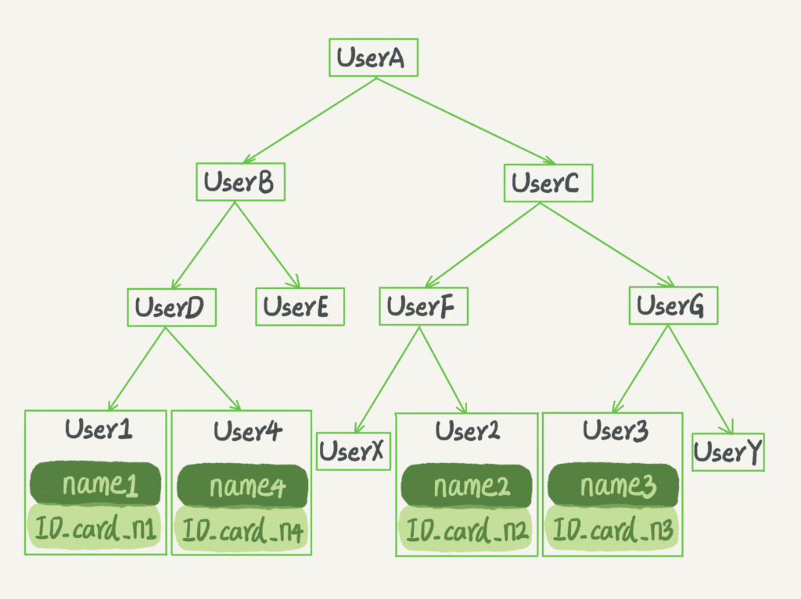

# 索引

## 1、索引常见模型

### 1、哈希表

适用：只有等值查询。范围查询很慢


### 2、数组

适合：等值查询和范围查询。在更新数据性能很差



### 3、二叉树



# 2、索引模型

```sql
create table T(
    id int primary key, 
    k int not null, 
    name varchar(16),
    index (k)
)engine=InnoDB;
(100,1)、(200,2)、(300,3)、(500,5) 和 (600,6)
```


主键索引的叶子节点存储的是整行数据，非主键索引的叶子节点存储的是主键的值。

# 3、索引维护

页分裂、页合并

主键长度越小，普通索引的叶子节点就越小，普通索引占用的空间页就越小。

# 4、索引使用

## 1、覆盖索引

索引中已经包含了要查询的字段

**由于覆盖索引可以减少树的搜索次数，显著提升查询性能，所以使用覆盖索引是一个常用的性能优化手段。**


## 2、最左前缀原则

最左前缀可以是联合索引的最左 N 个字段，也可以是字符串索引的最左 M 个字符。


## 3、索引下推

```sql
select * from tuser where name like '张 %' and age=10 and ismale=1;
```


