# 普通索引和唯一索引，如何选择

## 1、查询过程

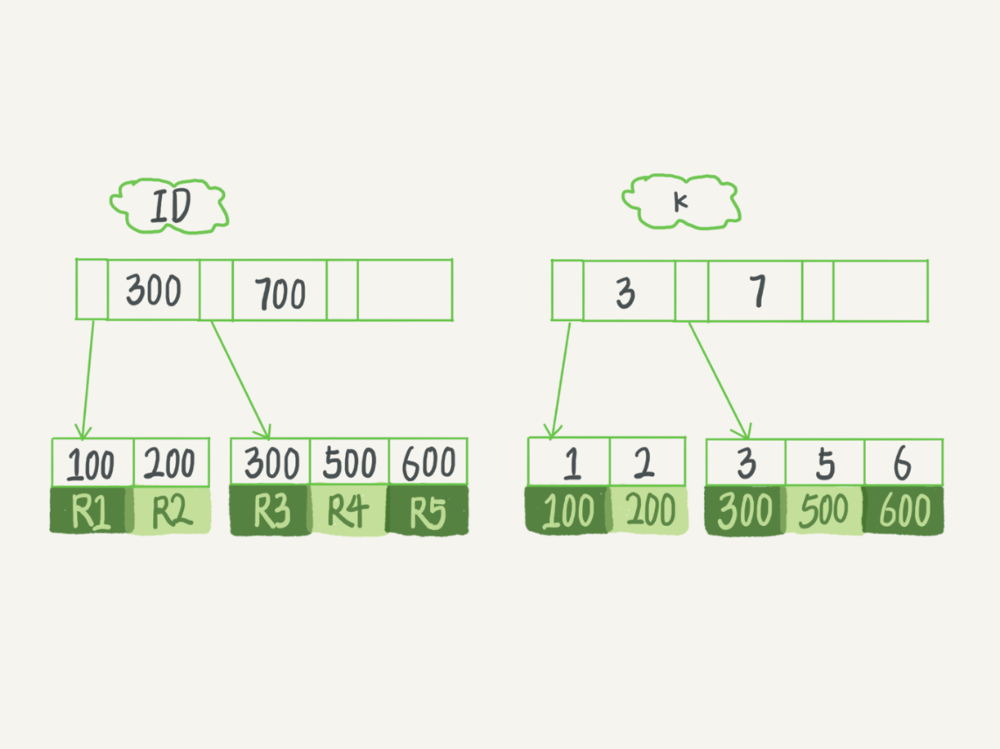

```sql
select id from T where k=5
```

- 对于普通索引来说，查找到满足条件的第一个记录 (5,500) 后，需要查找下一个记录，直到碰到第一个不满足 k=5 条件的记录。
- 对于唯一索引来说，由于索引定义了唯一性，查找到第一个满足条件的记录后，就会停止继续检索。

## 2、更新过程

> 当需要更新一个数据页时，如果数据页在内存中就直接更新，而如果这个数据页还没有在内存中的话，在不影响数据一致性的前提下，InnoDB 会将这些更新操作缓存在 change buffer 中，这样就不需要从磁盘中读入这个数据页了。在下次查询需要访问这个数据页的时候，将数据页读入内存，然后执行 change buffer 中与这个页有关的操作。通过这种方式就能保证这个数据逻辑的正确性。
>
> 
>
> change buffer 实际上它是可以持久化的数据
>
> 
>
> 将 change buffer 中的操作应用到原数据页，得到最新结果的过程称为 merge。除了访问这个数据页会触发 merge 外，系统有后台线程会定期 merge。在数据库正常关闭（shutdown）的过程中，也会执行 merge 操作

对于唯一索引来说，所有的更新操作都要先判断这个操作是否违反唯一性约束

而这必须要将数据页读入内存才能判断

**如果要在这张表中插入一个新记录 (4,400) 的话，InnoDB 的处理流程**

第一种情况是，这个记录要更新的目标页在内存中。这时，InnoDB 的处理流程如下：

- 对于唯一索引来说，找到 3 和 5 之间的位置，判断到没有冲突，插入这个值，语句执行结束；
- 对于普通索引来说，找到 3 和 5 之间的位置，插入这个值，语句执行结束。

第二种情况是，这个记录要更新的目标页不在内存中。这时，InnoDB 的处理流程如下：

- 对于唯一索引来说，需要将数据页读入内存，判断到没有冲突，插入这个值，语句执行结束；
- 对于普通索引来说，则是将更新记录在 change buffer，语句执行就结束了

将数据从磁盘读入内存涉及随机 IO 的访问，是数据库里面成本最高的操作之一。change buffer 因为减少了随机磁盘访问，所以对更新性能的提升是会很明显的

## 3、change buffer使用场景

> 对于写多读少的业务来说，页面在写完以后马上被访问到的概率比较小，此时 change buffer 的使用效果最好。这种业务模型常见的就是账单类、日志类的系统

## 4、索引选择和实践

> 如果所有的更新后面，都马上伴随着对这个记录的查询，那么你应该关闭 change buffer。而在其他情况下，change buffer 都能提升更新性能

## 5、change buffer和redo log

```sql
insert into t(id,k) values(id1,k1),(id2,k2);
```

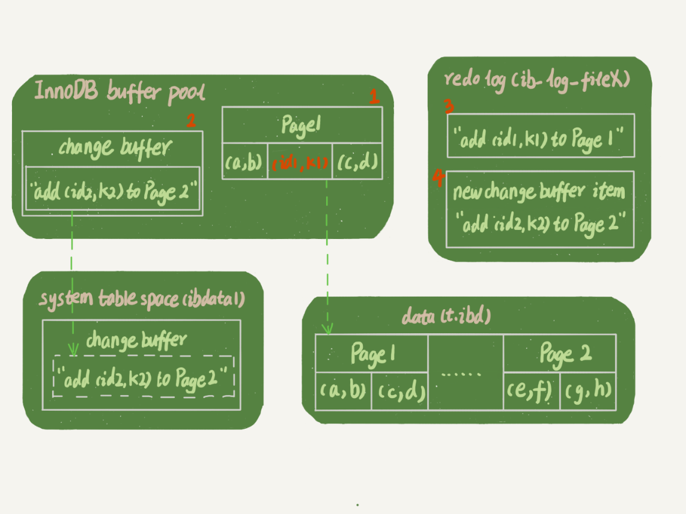

1. Page 1 在内存中，直接更新内存；
2. Page 2 没有在内存中，就在内存的 change buffer 区域，记录下“我要往 Page 2 插入一行”这个信息
3. 将上述两个动作记入 redo log 中（图中 3 和 4）

> 执行这条更新语句的成本很低，就是写了两处内存，然后写了一处磁盘（两次操作合在一起写了一次磁盘），而且还是顺序写的
>
> 同时，图中的两个虚线箭头，是后台操作，不影响更新的响应时间

如果读语句发生在更新语句后不久，内存中的数据都还在，那么此时的这两个读操作就与系统表空间（ibdata1）和 redo log（ib_log_fileX）无关了

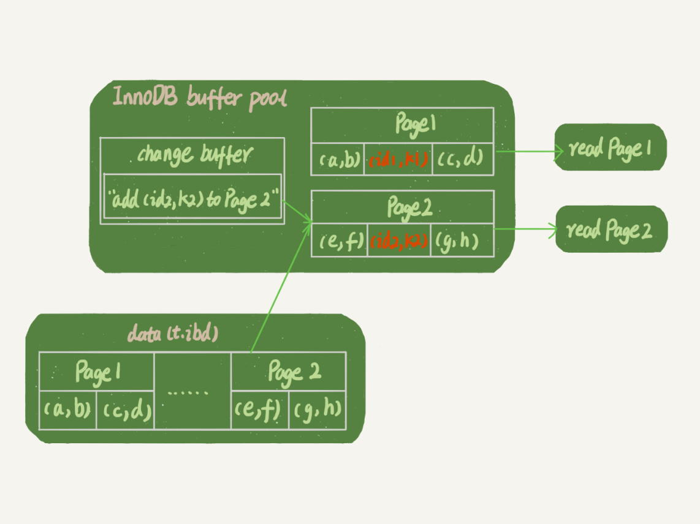

1. 读 Page 1 的时候，直接从内存返回。有几位同学在前面文章的评论中问到，WAL 之后如果读数据，是不是一定要读盘，是不是一定要从 redo log 里面把数据更新以后才可以返回？其实是不用的。你可以看一下这个状态，虽然磁盘上还是之前的数据，但是这里直接从内存返回结果，结果是正确的。
2. 要读 Page 2 的时候，需要把 Page 2 从磁盘读入内存中，然后应用 change buffer 里面的操作日志，生成一个正确的版本并返回结果。可以看到，直到需要读 Page 2 的时候，这个数据页才会被读入内存

> 如果要简单地对比这两个机制在提升更新性能上的收益的话，redo log 主要节省的是随机写磁盘的 IO 消耗（转成顺序写），而 change buffer 主要节省的则是随机读磁盘的 IO 消耗

# 选错索引

```sql
CREATE TABLE `t` (
  `id` int(11) NOT NULL AUTO_INCREMENT,
  `a` int(11) DEFAULT NULL,
  `b` int(11) DEFAULT NULL,
  PRIMARY KEY (`id`),
  KEY `a` (`a`),
  KEY `b` (`b`)
) ENGINE=InnoDB;

# 插入10万行记录
delimiter ;;
create procedure idata()
begin
  declare i int;
  set i=1;
  while(i<=100000)do
    insert into t values(i, i, i);
    set i=i+1;
  end while;
end;;
delimiter ;
call idata();

# 分析sql
select * from t where a between 10000 and 20000;
```

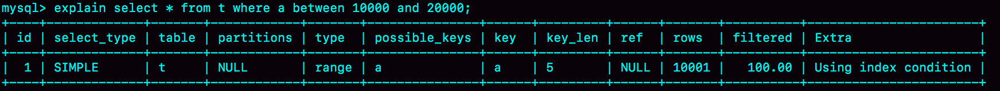

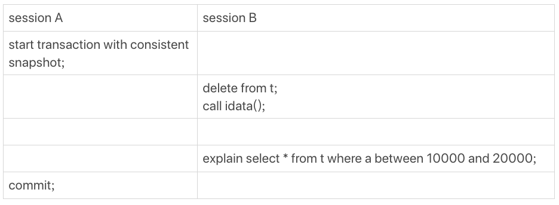

```sql
set long_query_time=0;
select * from t where a between 10000 and 20000; /*Q1*/
select * from t force index(a) where a between 10000 and 20000;/*Q2*/
```

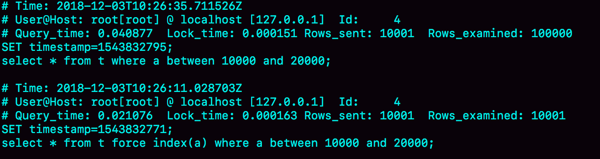

## 1、优化器逻辑

> 选择索引是优化器的工作
>
> 在数据库里面，扫描行数是影响执行代价的因素之一。扫描的行数越少，意味着访问磁盘数据的次数越少，消耗的 CPU 资源越少
>
> 当然，扫描行数并不是唯一的判断标准，优化器还会结合**是否使用临时表、是否排序**等因素进行综合判断

## 2、扫描行数

**show index** 判断索引的基数，基数越大，区分度越好

基数统计：采样统计

主键的扫描行数是：

```sql
show table status 【表名】
```

非主键索引的扫描行数是：

> 采样统计的时候，InnoDB 默认会**选择 N 个数据页**，统计这些页面上的不同值，得到一个平均值，然后乘以这个索引的页面数，就得到了这个索引的基数
>
> 而数据表是会持续更新的，索引统计信息也不会固定不变。所以，当**变更的数据行数超过 1/M 的时候**，会自动触发重新做一次索引统计

在 MySQL 中，有两种存储索引统计的方式，可以通过设置参数 **innodb_stats_persistent** 的值来选择：

- 设置为 on 的时候，表示统计信息会持久化存储。这时，默认的 N 是 20，M 是 10。
- 设置为 off 的时候，表示统计信息只存储在内存中。这时，默认的 N 是 8，M 是 16。

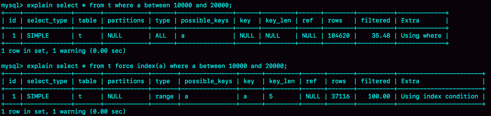

Q1 的结果还是符合预期的，rows 的值是 104620；但是 Q2 的 rows 值是 37116，偏差就大了。用 explain 命令看到的 rows 是只有 10001 行，是这个偏差误导了优化器的判断。

> Q1时没有强制指定哪个索引，优化器会去分析：
>
> 如果走主键索引全表扫描就要扫描10w行，虽然数量多但不需要回表；
>
> 如果走普通索引a就“估计”要扫描3.7w行，数量跟10w相差不多了而且还要回表。所以优化器决定走全表扫描。 Q2时强制指定了走普通索引a，优化器虽然觉得要扫3.7w行并且要回表不划算，但因为被强制指定了只能执行，真正执行的时候其实只扫了1w行+回表，最终这个代价是小于10w行的主键全表扫描的。

## 3、错误的扫描行数

1.为什么没有session A,session B扫描的行数是1W 

由于mysql是使用标记删除来删除记录的,并不从索引和数据文件中真正的删除。 如果delete和insert中间的间隔相对较小,purge线程还没有来得及清理该记录。 如果主键相同的情况下,新插入的insert会沿用之前删除的delete的记录的空间。 由于相同的数据量以及表大小,所以导致了统计信息没有变化 

2.为什么开启了session A,session B扫描行数变成3W 

由于session A开启了一致性读,目的为了保证session A的可重复读,insert只能 另起炉灶,不能占用delete的空间。所以出现的情况就是delete虽然删除了,但是 未释放空间,insert又增加了空间。导致统计信息有误

## 4、修正统计信息

> analyze table t 命令，可以用来重新统计索引信息

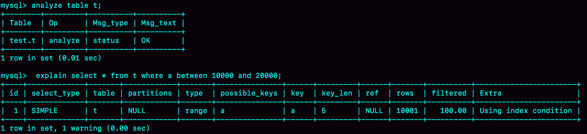

## 5、其他信息判断

```sql
select * from t where (a between 1 and 1000)  and (b between 50000 and 100000) order by b limit 1;
```

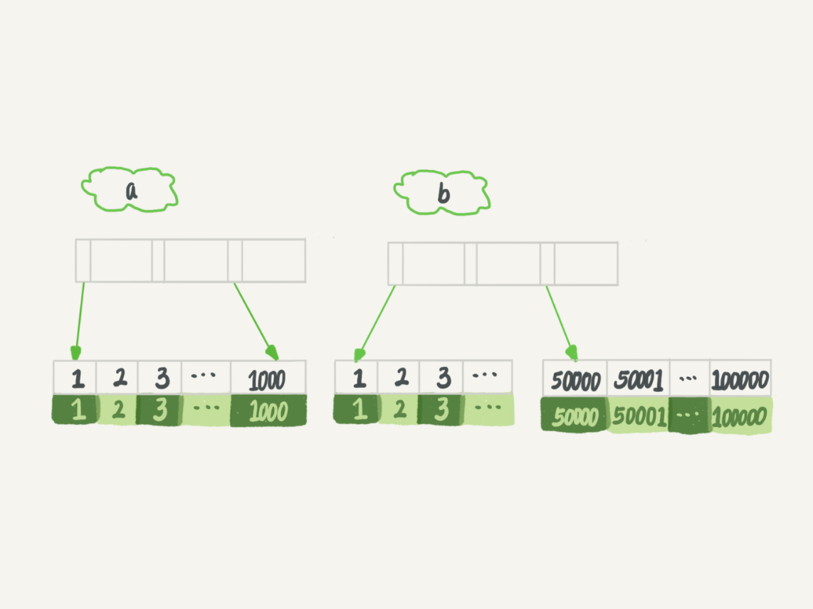

如果使用索引 a 进行查询，那么就是扫描索引 a 的前 1000 个值，然后取到对应的 id，再到主键索引上去查出每一行，然后根据字段 b 来过滤。显然这样需要扫描 1000 行。

如果使用索引 b 进行查询，那么就是扫描索引 b 的最后 50001 个值，与上面的执行过程相同，也是需要回到主键索引上取值再判断，所以需要扫描 50001 行

```sql
explain select * from t where (a between 1 and 1000) and (b between 50000 and 100000) order by b limit 1;
```

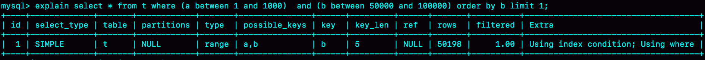

> 1）因为有 order by b，优化器认为走索引 b 可以避免排序； 
>
> 2）又有 limit 1，优化器认为只要找到了 1 条满足条件的记录，索引 b 的遍历就可以提前终止，虽然可能要遍历 50001 条记录，但是优化器认为这是值得冒险的事，所以决定了走索引 b；

## 6、索引选择异常和处理

### 1、走强索引

```sql
force index()
# 选择走的强制索引
```

### 2、修改sql语句

```sql
order by b limit 1” 改成 “order by b,a limit 1
# 引导mysql使用我们期望的索引
```

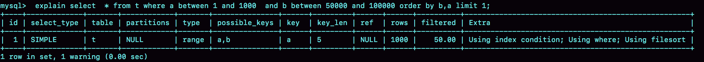

### 3、新建索引或删除索引

# 怎么给字符串加索引

## 1、前缀

```sql
select count(distinct left(email,4)）as L4, count(distinct left(email,5)）as L5, count(distinct left(email,6)）as L6, count(distinct left(email,7)）as L7,from SUser;
```

前缀索引对覆盖索引产生影响

## 2、倒叙存储


## 3、hash字段


## 4、小结

1. 直接创建完整索引，这样可能比较占用空间；
2. 创建前缀索引，节省空间，但会增加查询扫描次数，并且不能使用覆盖索引；
3. 倒序存储，再创建前缀索引，用于绕过字符串本身前缀的区分度不够的问题；
4. 创建 hash 字段索引，查询性能稳定，有额外的存储和计算消耗，跟第三种方式一样，都不支持范围扫描。